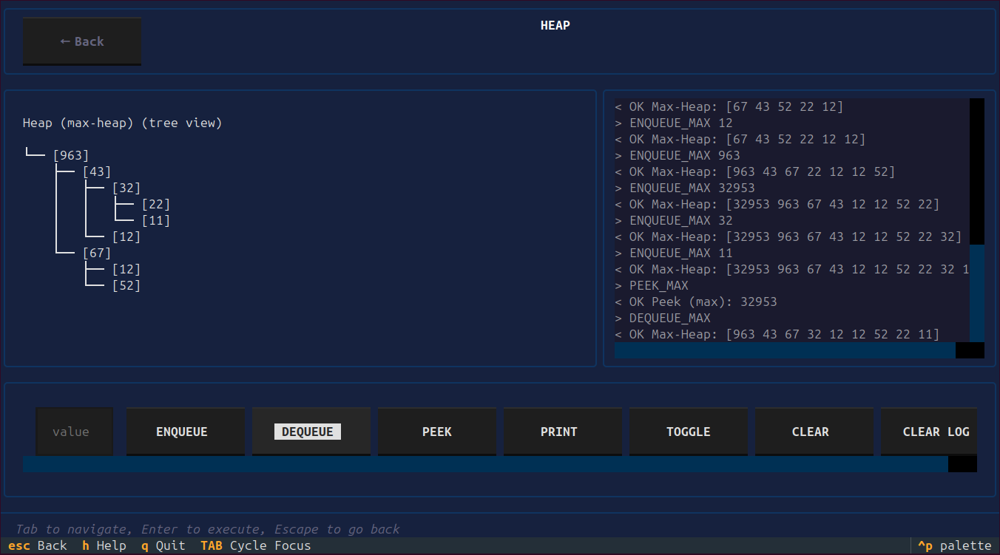

<div align="center">

# TraceDSA

**Interactive Data Structures Visualizer** Built with C++23 + Python Textual TUI

[](https://www.python.org/)
[](LICENSE)
[](https://pypi.org/project/tracedsa/)
[](https://github.com/HA2077/TraceDSA)

</div>

---

> **TraceDSA lets you watch data structures think.** Push a value, enqueue a node, insert into a BST and see exactly what happens inside, operation by operation, in your terminal.

---



---

## Why TraceDSA

Most DSA resources show you the theory. TraceDSA shows you the behavior.

Every operation is visualized live in ASCII the structure updates, the op log records what happened, and you can see the state of the data structure at every step. It's built for students who want to actually understand what's happening, not just memorize definitions.

## Why No STL Containers

Every data structure in the C++ backend is built from scratch using a custom `ArrayList` a header-only dynamic array that replaces `std::vector`. No `std::stack`, no `std::queue`, no `std::priority_queue`.

This was a deliberate decision: if you're building a tool to teach how data structures work, you shouldn't be hiding the implementation behind the standard library. The C++ core is the point.

---

## Install & Run

```bash
pip install tracedsa
tdsa
```

On modern Linux distros (PEP 668):

```bash
python3 -m venv .venv
source .venv/bin/activate
pip install tracedsa
tdsa
```

Press `s` or click **START** on the splash screen.

---

## Data Structures

| Category | Implementations | Visualization |
|----------|----------------|---------------|
| **Stack** | Array, Linked List | Vertical |
| **Queue** | Array, Linked List, Circular | Horizontal |
| **Linked List** | Singly, Doubly | Arrow nodes |
| **BST** | Binary Search Tree | Sideways tree |
| **Heap** | Min-Heap, Max-Heap | Tree + Array toggle |

---

## Features

- Live ASCII visualization after every operation
- Info screen per DS Big O, pros/cons, use cases
- Real-time op log with color-coded responses
- Min/Max heap toggle
- Search and filter from the menu
- Cross-platform Linux, Windows, macOS
- Zero-config install via pip

---

## How It Works

TraceDSA spawns standalone C++23 binaries and communicates via a custom stdin/stdout bridge protocol. The Python Textual TUI sends commands (`PUSH 10`, `ENQUEUE 5`, `INSERT 42`) and receives structured state responses that drive the ASCII widgets.

```
[Python TUI] --command--> [C++ binary] --state--> [ASCII widget update]
```

The C++ binaries are bundled inside the package no compiler needed to run it.

---

## Project Architecture

```
TraceDSA/
├── C++ Core (no STL containers)
│   ├── ArrayList/              ← header-only dynamic array (replaces std::vector)
│   ├── Stack/, Queue/, LinkedList/, BST/, PriorityQueue/
│   └── *_interactive.cpp       ← stdin/stdout bridge per DS
│
├── tracedsa/ (Python TUI)
│   ├── __main__.py
│   ├── bridge.py               ← DSBridge, binary resolution, os.chmod
│   ├── screens/                ← splash, menu, info_screen, trace_screen
│   └── widgets/                ← ascii_array, ascii_tree, ascii_heap, ops_log
│
├── makefile.inter              ← Linux build
├── makefile.windows            ← Windows build (MinGW)
├── makefile.macos              ← macOS build (g++-14)
└── pyproject.toml              ← hatchling packaging config
```

---

## Development Setup

### Prerequisites

- C++23 compiler (`g++` recommended, `g++-14` on macOS)
- Python 3.10+
- `make`

### Build & Run

```bash
# Build C++ interactive binaries (Linux)
make -f makefile.inter

# Run the TUI
cd tracedsa && python -m tracedsa
```

Windows:
```bash
make -f makefile.windows
```

macOS:
```bash
CXX=g++-14 make -f makefile.macos
```

See `DEVELOPMENT.md` for the full guide including the bridge protocol reference and how to add a new data structure.

---

## Roadmap

See [ROADMAP.md](docs/ROADMAP.md) for the full versioned plan.

**Coming in v1.0.x:** bug fixes, keyboard shortcuts, heap toggle fix, arrow key navigation  
**Coming in v1.1:** sorting algorithm visualizations (step-by-step states from C++)

---

## Contributing

Contributions welcome — new data structures, bug fixes, UI improvements, docs.  
Please read `CONTRIBUTING.md` before opening a PR.

---

## Author

**HA** [GitHub](https://github.com/HA2077) · [LinkedIn](https://www.linkedin.com/in/hassanahmedcs/)

## License

MIT — see [LICENSE](LICENSE)

---

<div align="center">
Made with ❤️ for learning and teaching Data Structures & Algorithms.
</div>